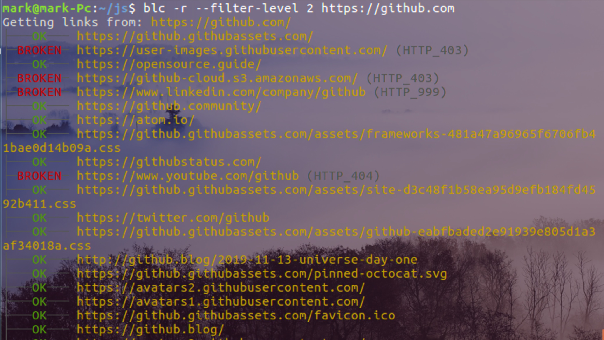
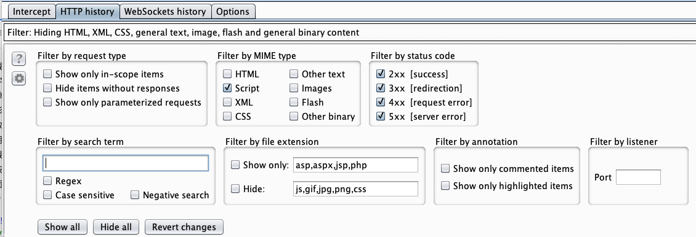

# 挖洞经验 | 从失效的链接中挖掘存储xss，利用js拓展攻击面
## 前言
子域名劫持广为人知，失效的链接劫持却是第一次听说。和子域名劫持类似，当外部引入js文件时，例如`<script src="example.com/1.js"></script>`，当`example.com`失效，攻击者可以注册此域名，加入payload，造成存储xss，甚至漫游内网。

## 检测无效的链接


```
blc -r --filter-level 2 https://github.com
```



## 利用js拓展攻击面
js信息泄漏是老话题了，推荐Burp神器，设置HTTP history的过滤规则，然后批量导出即可。



，shell利用小脚本

```
for i in $(cat http-history.txt); do
	ruby ~/tool/relative-url-extractor/extract.rb $i >> dir.txt
done
```

## 最后
已同步更新至gayhub的[BugBountyTips](https://github.com/mark-zh/BugBountyTips)，欢迎Star。

## 参考

- http://ghostlulz.com/broken-link-hijacking/


